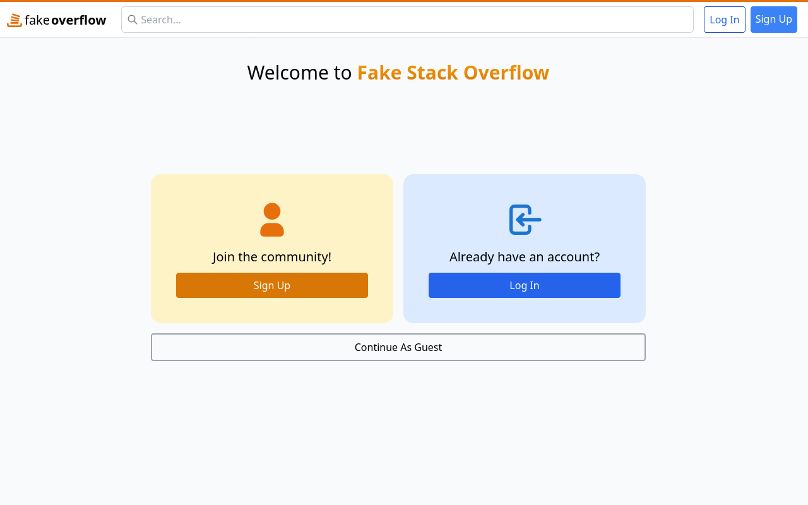
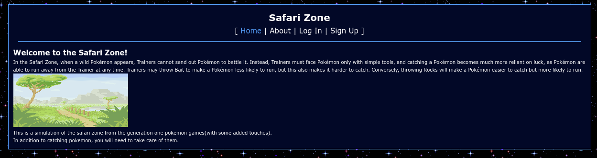

# Projects

## Web Development

### Fake Overflow

**April 2024 - May 2024**

> typescript, react, mongo, express, node, tailwind

Fake Overflow is a clone of Stack Overflow.

- [Demo](https://fake-overflow-site.onrender.com/)
- [Source](https://github.com/alkmei/fake-overflow)

### Safari Zone

**November 2022**

> typescript, vue, firebase

Safari Zone is a web game where you catch Pokémon in a simulation of the safari zone from the first generation Pokémon games.

- [Demo](https://safari-zone.netlify.app/)

## Game Development

### Autopsy

**April 2024 - May 2024**

> typescript, wolfie2d, webgl

Autopsy is a 2d platformer, created using our professor's custom Typescript game engine. The game engine was designed to be as barebones as possible.

- [Demo](https://autopsy-32c5e.web.app/)
- [Source](https://github.com/alkmei/autopsy-wolfie2d)

## Misc

### OpenScribe

**WIP**

> typescript, rust, vue, tauri

OpenScribe is an IDE for writers. It is heavily WIP and will aim to be a feature-rich writing/planning program.

- [Source](https://github.com/alkmei/OpenScribe)
